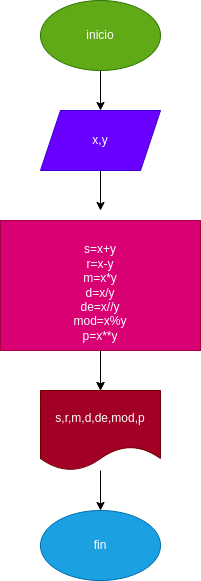

# Ejercicio No.3

## Calcular la suma, resta, multiplicacion, division, division entera, modulo y potencia de X y Y

# ANALISIS

Variables de entrada (input)

x: primer valor de ingresar
Y: segun valor de ingresar

Variables de proceso y salida (processing, storange, output)

S: suma
R: resta
M: muliplicacion
D: division 
DE: division entera
MOD: modulo
P: potencia 

# DISEÑO

# CONSTRUCCION

